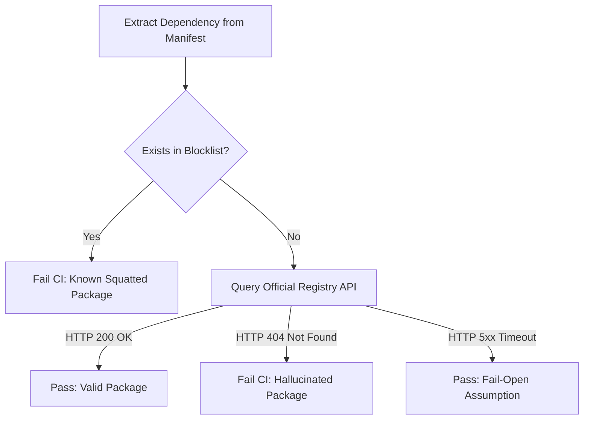

# AI Dependency Guard

## Table of Contents
- [Overview](#overview)
- [Architecture](#architecture)
- [Prerequisites](#prerequisites)
- [Usage Instructions](#usage-instructions)
- [Expected Output](#expected-output)
- [Technical Specifications](#technical-specifications)
- [Troubleshooting](#troubleshooting)
- [Support Policy and License](#support-policy-and-license)

## Overview
AI Dependency Guard is an automated, zero-dependency GitHub Action designed to mitigate the risk of Phantom Dependency Squatting within Continuous Integration (CI) pipelines.

Large Language Models (LLMs) utilized for code generation frequently hallucinate non-existent dependencies within production manifests (`requirements.txt` and `package.json`). When developers commit these fabricated namespaces to a version control system, the repository becomes vulnerable to supply chain attacks. Threat actors can register these hallucinated names on public registries, resulting in arbitrary code execution during subsequent downstream builds.

This action parses dependency manifests during the Pull Request or push phases and performs real-time validation against the official PyPI and npm Application Programming Interfaces (APIs). The CI pipeline fails deterministically when it detects a hallucinated dependency.

## Architecture

The action employs a dual-validation mechanism to ensure comprehensive protection:



1. **Tier 1 (Explicit Blocklist / HTTP 200 Bypass Mitigation):**
   When an attacker or researcher registers a hallucinated package, the public registry returns an `HTTP 200 OK` status, bypassing 404-checkers. This action evaluates every extracted dependency against an explicit blocklist of known hijacked namespaces prior to executing network requests.

2. **Tier 2 (Real-Time API Validation / HTTP 404 Detection):**
   The action queries dependencies not intercepted by the Tier 1 blocklist against the official PyPI and npm JSON APIs. When the registry returns an `HTTP 404 Not Found` response, the action flags the dependency as an active hallucination risk.

## Prerequisites
- GitHub Actions enabled on the repository.
- A repository containing a `requirements.txt` or `package.json` file.

## Usage Instructions

To integrate AI Dependency Guard into a CI/CD pipeline, create `.github/workflows/ai-guard.yml` with the following configuration:

```yaml
name: AI Dependency Guard Validation
on: [push, pull_request]

jobs:
  validate-dependencies:
    runs-on: ubuntu-latest
    steps:
      - name: Checkout Repository
        uses: actions/checkout@v4
        
      - name: Execute AI Dependency Guard
        uses: fabriziosalmi/ai-dependency-guard@v1
        with:
          scan_path: '.'
          blocklist: 'keyrings,jaraco,google-colab,ruamel,en_core_web_sm'
```

## Expected Output

When the action detects a hallucination, it terminates the workflow with an exit code of `1` and outputs the following error log:

```text
🔍 Scanning ./requirements.txt...
##[error]🚨 LLM DEPENDENCY HALLUCINATION DETECTED! 🚨
The following packages are EXPLICITLY BLOCKED because they are known to be defensively squatted or hijacked (HTTP 200 Bypass):
##[error]Known Squatted Package 'keyrings' blocked on PyPI.
The following packages DO NOT EXIST in the public registry. This is a critical security risk (Phantom Dependency Squatting).
##[error]Hallucinated package 'totally-fake-hallucination-package' not found on PyPI.
```

## Technical Specifications
- **Supported Manifests:** `requirements.txt` (Python/PyPI), `package.json` (Node.js/npm).
- **Network Constraints:** The action utilizes standard HTTP libraries and incorporates deliberate timing delays (100 milliseconds) between API requests to strictly adhere to registry rate-limiting policies.
- **Fail-Open Posture:** In the event of a registry network timeout or HTTP 5xx error, the action defaults to an `HTTP 200` assumption. This prevents blocking the CI pipeline due to external infrastructure instability.

## Troubleshooting

1. **Error: Rate Limit Exceeded (HTTP 429)**
   - **Cause:** The repository contains an exceptionally large manifest exceeding the registry rate limits despite the 100 millisecond delay.
   - **Solution:** Split manifests or cache dependencies locally.

2. **Error: Valid internal package flagged as 404**
   - **Cause:** The action queried a private corporate dependency against the public PyPI/npm registry.
   - **Solution:** Add the internal package name to the `blocklist` configuration to bypass public registry checks.

## Support Policy and License
This project is currently under Active Maintenance. Issues regarding public supply chain risks should be reported privately via the repository's Security Advisory feature.
